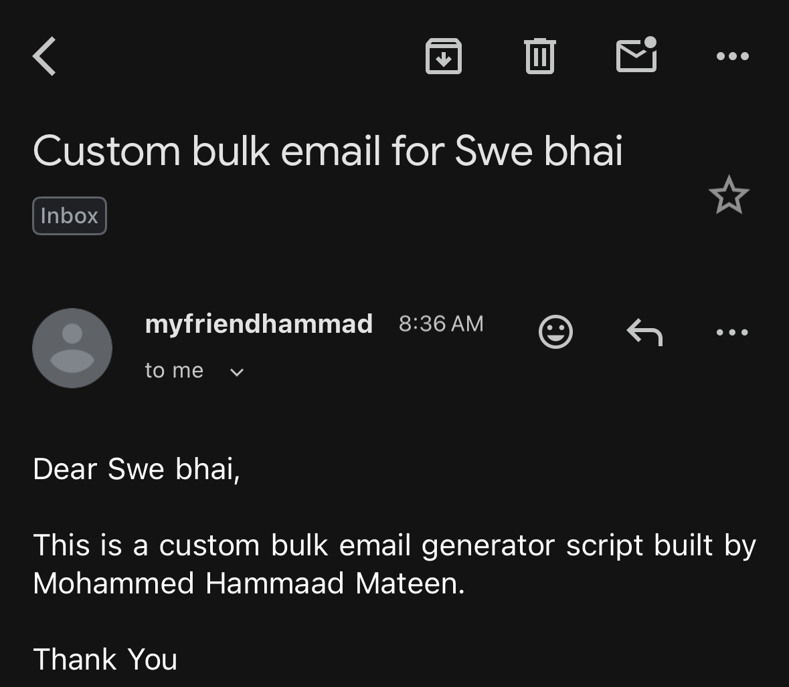
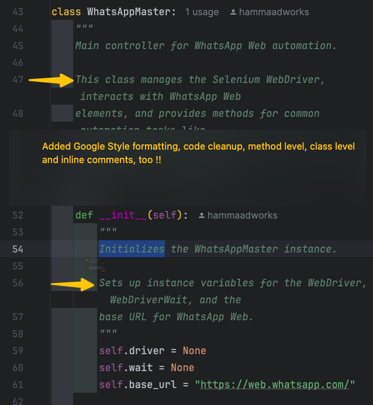
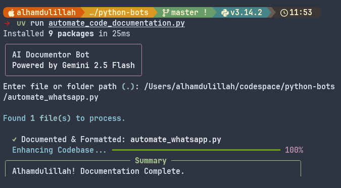

# 🤖 BotScript: The Automation Legacy of [@hammaadworks](https://github.com/hammaadworks)

[](https://hammaadworks.github.io/python-bots/)

Welcome to **BotScript**, a premium collection of the most useful, high-performance automations I've built over the years. This isn't just a repo; it's a showcase of how I turn complex workflows into elegant, "one-filer" solutions.

I am **Mohammed Hammaad Mateen**, known across the web as **hammaadworks**. I build tools that save time, solve problems, and look beautiful while doing it.

---

## 🚀 The Elite Six
Every script here is a self-contained powerhouse, designed for instant execution with `uv`.

### 1. 📧 Bulk Mailer Pro
**Use Case:** `Marketing` `Outreach` `Newsletters`
A professional-grade email automator with a high-fidelity Rich CLI and secure SMTP handling.
- **File:** `bulk_mail.py`
- **Asset:** <br>
   <br>
  
  https://github.com/hammaadworks/python-bots/raw/master/assets/bulk_mail/demo.mp4

### 2. 📝 Google Forms Master
**Use Case:** `Data Entry` `Testing` `Survey Automation`
An autonomous, heuristic-driven form filler that scans the DOM and uses Faker to submit data instantly.
- **File:** `automate_google_forms.py`
- **Asset:** <br>
  https://github.com/hammaadworks/python-bots/raw/master/assets/google_forms/demo.mov

### 3. 💬 WhatsApp Master
**Use Case:** `Customer Support` `Bulk Messaging`
A Selenium-based powerhouse for automating WhatsApp Web messaging, including media and documents.
- **File:** `automate_whatsapp.py`

### 4. 📄 AI Documentor
**Use Case:** `Pre-commit Hook` `Code Quality` `Refactoring`
Your AI assistant powered by Gemini 2.0 Flash, designed to auto-document and format entire codebases. Accepts individual files or entire folders.
- **File:** `automate_code_documentation.py`
- **Asset:** <br>
   <br>
  

### 5. 🎮 Ztype Game Bot
**Use Case:** `Computer Vision` `OCR Testing` `Botting`
A high-score machine that uses real-time OCR and Computer Vision to dominate the Ztype typing game.
- **File:** `automate_ztype.py`
- **Asset:** <br>
  https://github.com/hammaadworks/python-bots/raw/master/assets/ztype/demo.mp4

### 6. 📺 Wgetube Pro (YouTube)
**Use Case:** `Content Creation` `Rote Learning` `Archiving`
A full-stack media hub with a Terminal UI for downloading, looping, and clipping YouTube content.
- **Files:** `ytd_cli.py` & `ytd_tui.py`

---

## 🛠 System Requirements (CRITICAL) for Wgetube Pro

The TUI and CLI rely on these system-level tools. Ensure they are installed and in your PATH:

### 1. VLC Media Player
Required for the **A-B Looper** (audio/video repetition).
- **Mac:** `brew install --cask vlc`
- **Linux:** `sudo apt install vlc`
- **Windows:** Download from [videolan.org](https://www.videolan.org/).

### 2. FFmpeg
Required for **Advanced Clipping** and high-quality audio extraction.
- **Mac:** `brew install ffmpeg`
- **Linux:** `sudo apt install ffmpeg`
- **Windows:** `choco install ffmpeg` or download from [ffmpeg.org](https://ffmpeg.org/).

## 📺 Wgetube Pro Usage

### Pro TUI Dashboard
```bash
uv run ytd_tui.py
```

### Interactive Downloader
```bash
uv run ytd_cli.py download
```

### Advanced Clipping & Stitching
```bash
uv run ytd_cli.py clip path/to/video.mp4
```

---

## 🤝 Connect with [@hammaadworks](https://github.com/hammaadworks)

I'm always looking for new challenges and professional opportunities. If you like what you see here, let's build something incredible together.

- **GitHub:** [https://github.com/hammaadworks](https://github.com/hammaadworks)
- **X (Twitter):** [https://x.com/hammaadworks](https://x.com/hammaadworks)
- **LinkedIn:** [https://linkedin.com/in/hammaadworks](https://linkedin.com/in/hammaadworks)
- **ProductHunt:** [https://www.producthunt.com/@hammaadworks](https://www.producthunt.com/@hammaadworks)
- **Email:** hammaadworks@gmail.com
- **Website:** [hammaadworks.com](https://www.hammaadworks.com) *(coming soon!)*

---

## ⚙️ Quick Setup
1. **Install `uv`:** `curl -LsSf https://astral.sh/uv/install.sh | sh`
2. **Run Anything:** `uv run <script_name>.py`

*Alhamdulillah. Built for performance, refined for you.*
